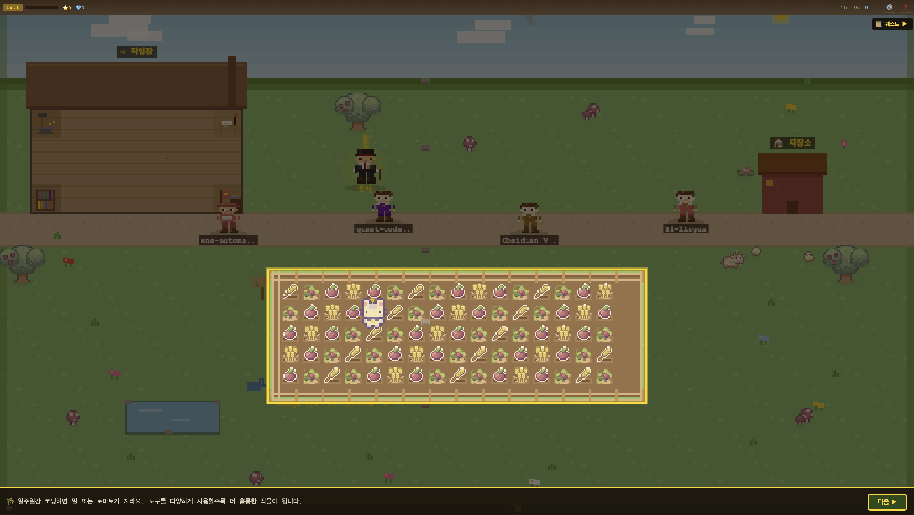
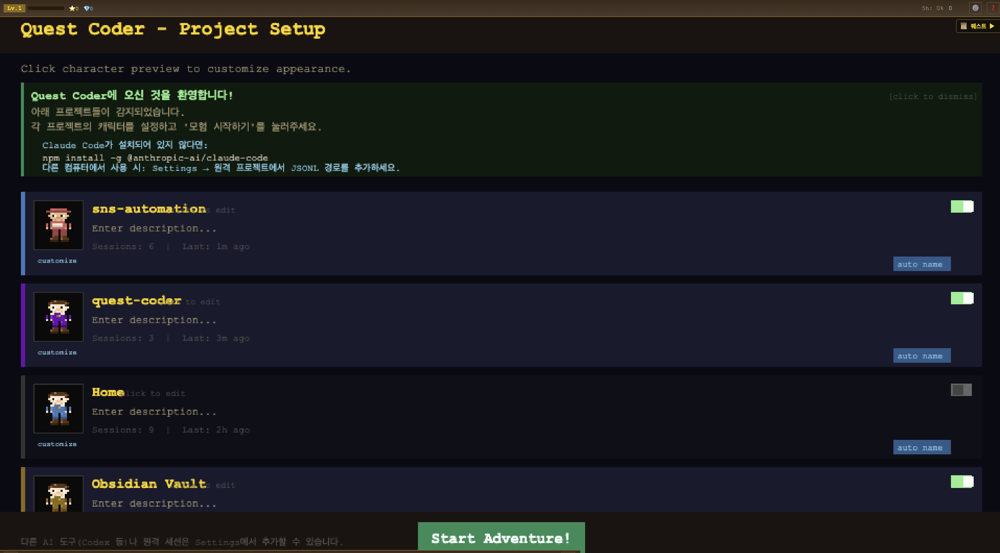
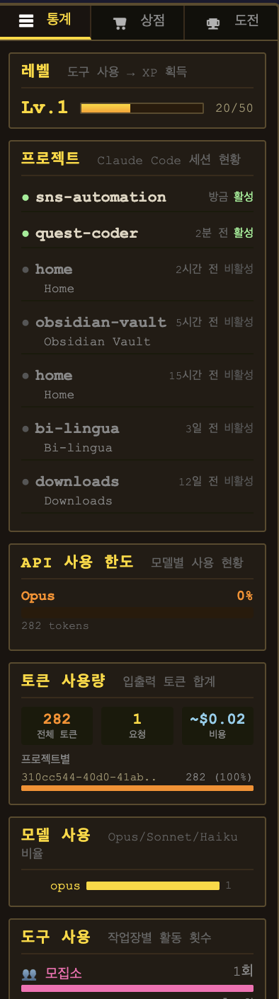
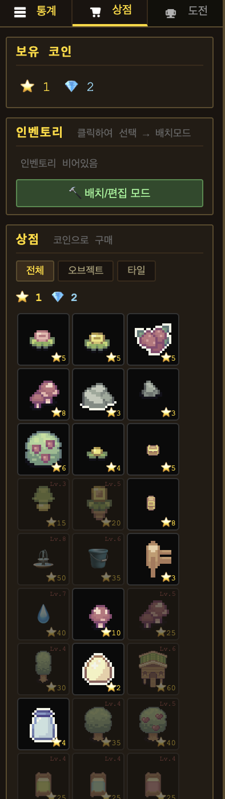
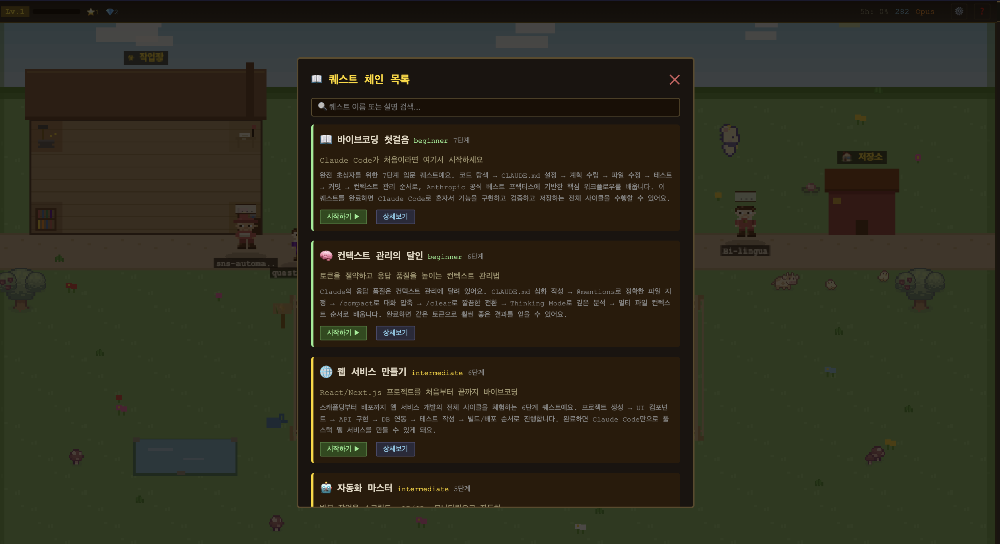
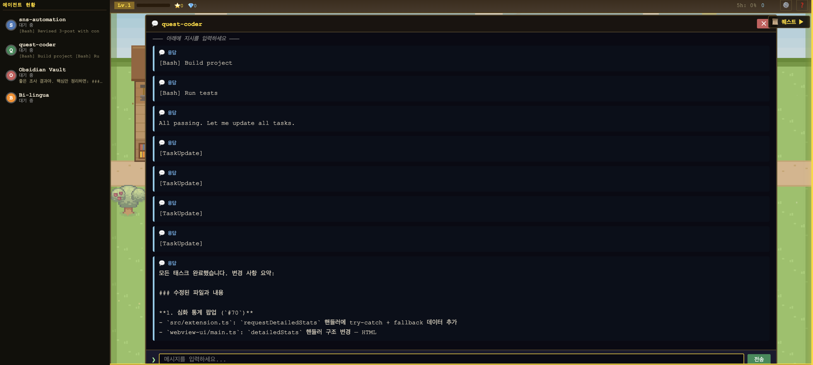
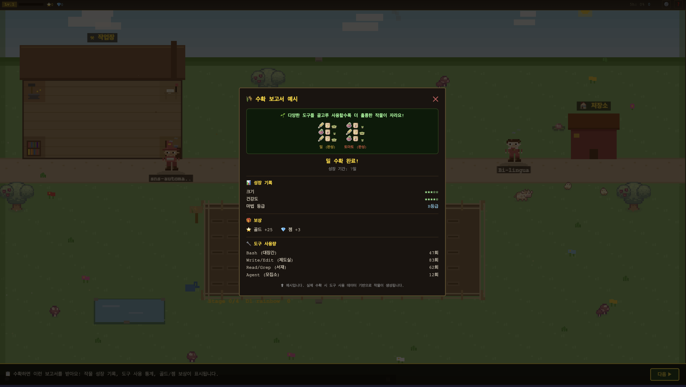

# Quest Coder 🎮

> AI 코딩을 게임처럼 — 코딩하면 마을이 성장합니다

Claude Code, Codex 등 AI 코딩 에이전트의 활동을 **픽셀 캐릭터 마을**로 시각화하는 VS Code 확장 프로그램입니다.
에이전트가 코드를 읽고 쓰면 캐릭터가 작업장을 돌아다니고, 농장에서 작물이 자라고, 마을이 점점 발전합니다.

**LLMOps 대시보드 + 게이미피케이션**을 결합해서 코딩 활동을 모니터링하고 동기를 부여합니다.

---

## 빠른 설치

### 방법 1: Claude Code로 설치 (권장)
Claude Code 터미널에 아래 한 줄을 입력하세요:

```
이 VS Code 확장을 설치해줘: https://github.com/ernestolee13/quest-coder/releases/download/v0.0.1/quest-coder-0.0.1.vsix
```

### 방법 2: 수동 설치
1. [quest-coder-0.0.1.vsix](https://github.com/ernestolee13/quest-coder/releases/download/v0.0.1/quest-coder-0.0.1.vsix) 다운로드
2. `Cmd+Shift+P` → `Extensions: Install from VSIX...` → 파일 선택
3. `Cmd+Shift+P` → `Quest Coder: Show Character Panel`

---

## 스크린샷

### 🏘️ 마을 & 농장
프로젝트별 캐릭터가 마을에서 활동합니다. 도구 사용에 따라 대장간/제도실/서재/모집소를 이동하며, 농장에서는 코딩 활동량에 비례해 작물이 성장합니다.



### 👤 프로젝트 셋업
Claude Code 세션을 자동 감지하여 프로젝트별 캐릭터를 생성합니다. 헤어/의상/악세서리/피부톤/컬러를 자유롭게 조합하세요.



### 📊 통계 대시보드
토큰 사용량(5시간/24시간/7일 롤링), 모델별 비율(Opus/Sonnet/Haiku), API 사용 한도, 프로젝트별 분석을 실시간으로 확인할 수 있습니다.



### 📊 심화 분석 (5탭 오버레이)
심화 분석 버튼을 누르면 **개요/도구/비용/프로젝트/패턴** 5개 탭으로 구성된 상세 분석 오버레이가 열립니다.
- 7일 비용 추이, 캐시 히트율, 평균 세션 시간
- 도구별 사용 빈도 + 오류율, MCP 서버 사용량
- 모델별 비용 비율, 프로젝트별 토큰/비용 테이블
- 시간대별 활동 히트맵, 컨텍스트 윈도우 사용률

### 🛒 상점 & 꾸미기
60개 이상의 Sprout Lands 픽셀아트 아이템을 골드/젬으로 구매하고 격자에 배치하세요. Ctrl+R로 회전, 타일/오브젝트 카테고리 분류를 지원합니다.



### 📜 퀘스트 체인
Anthropic 공식 베스트 프랙티스 기반 7개 시나리오, 40단계 학습 코스. 바이브코딩 첫걸음부터 웹 개발, 자동화, MCP 개발까지 단계별로 안내합니다.



### ✨ 퀘스트 생성 (AI) & 🌐 커뮤니티
- **AI 생성**: 학습하고 싶은 문서 URL을 입력하면 Claude가 분석해서 5-8단계 학습 퀘스트를 자동 생성합니다.
- **커뮤니티**: 다른 사용자가 공유한 퀘스트를 불러와서 바로 시작할 수 있습니다.
- **공유**: 내가 만든 퀘스트를 GitHub Gist + Issue로 공유합니다.

### 💬 인라인 대화
패널에서 바로 Claude와 대화할 수 있습니다. `--resume`으로 이전 세션을 이어가거나, 터미널로 바로 전환할 수 있습니다.



### 🌾 수확 보고서
밀 🌾 또는 토마토 🍅를 선택하고 7일간 코딩하면 작물이 완성됩니다. 다양한 도구를 사용할수록 품질이 올라가고, 수확 시 골드/젬 보상을 받습니다.



### 🌐 한/영 전환
설정에서 한국어↔English 전환 가능. 150개 이상의 UI 라벨이 번역됩니다.

---

## 주요 기능

| 기능 | 설명 |
|------|------|
| 🏘️ **코딩 마을** | 도구 사용에 따라 캐릭터가 작업장을 이동하며 활동 시각화 |
| 📊 **LLMOps 대시보드** | 토큰 사용량, 모델 비율, API 한도, 비용 추정, 심화 분석 5탭 |
| 🌾 **농장 시스템** | 7일 성장 주기, 밀/토마토 선택, 수확 보상 (골드/젬) |
| 🏆 **퀘스트 체인** | 7시나리오 40단계 + AI 커스텀 퀘스트 생성 + 커뮤니티 공유 |
| 🛒 **상점** | 60+ 픽셀아트 아이템, 격자 배치, 회전, 타일/오브젝트 분류 |
| 💬 **인라인 대화** | 세션 이어가기, 집사 팁, 터미널 전환 |
| 👤 **캐릭터 커스터마이징** | 헤어 6종, 의상 5종, 악세서리 7종, 피부톤 4종, 컬러 14종 |
| 🔌 **멀티 도구** | Claude Code + Codex CLI + 커스텀 로그 파일 |
| 🌐 **한/영 지원** | 설정에서 전환, 150+ UI 라벨 번역 |
| 📝 **피드백** | GitHub Issue 직접 등록 (gh CLI 연동) |

---

## 필수 요건
- macOS 또는 Linux
- [Claude Code](https://claude.ai/code) CLI 설치 (전체 기능 사용 시)
- 선택: Codex CLI, `gh` CLI (퀘스트 공유/피드백용)

## 시작하기

1. **패널 열기** — Claude Code 프로젝트가 캐릭터로 표시됩니다
2. **집사 클릭** 🎩 — 대화, 통계, 튜토리얼, 퀘스트, 수확 보고서
3. **퀘스트 시작** — Claude Code 베스트 프랙티스를 단계별로 학습
4. **아이템 구매** — 도구 사용으로 골드/젬 획득, 마을 꾸미기
5. **커스텀 퀘스트** — URL 입력하면 AI가 학습 코스 자동 생성

## 단축키

| 키 | 동작 |
|----|------|
| `Ctrl+1` | 에이전트 사이드바 토글 |
| `Ctrl+2` | 대시보드 토글 |
| `Ctrl+R` | 아이템 회전 (배치 모드) |
| `ESC` | 취소 / 오버레이 닫기 |

## 지원 환경

| | macOS | Linux | Windows |
|---|:---:|:---:|:---:|
| VS Code | ✅ | ✅ | ❌ |
| Cursor | ✅ | ✅ | ❌ |
| Antigravity | ✅ | - | - |

## 피드백 & 후원

- 앱 내: 집사 메뉴 → 📝 피드백 (gh CLI 인증 필요)
- GitHub: [Issues](https://github.com/ernestolee13/quest-coder/issues)
- 후원: [Ko-fi](https://ko-fi.com/ernestolee) ☕

## 커뮤니티 퀘스트

누구나 퀘스트를 만들고 공유할 수 있습니다:
- **만들기**: 집사 → ✨ 퀘스트 만들기 → URL 입력하면 AI가 자동 생성
- **공유**: 튜토리얼 목록에서 커스텀 퀘스트 옆 `🔗 공유` 클릭
- **불러오기**: 집사 → ✨ 퀘스트 만들기 → 🌐 커뮤니티 탭

예시 퀘스트 ([Releases](https://github.com/ernestolee13/quest-coder/releases)에서 JSON 다운로드 → 📋 JSON 가져오기):

| 퀘스트 | 설명 |
|--------|------|
| [🪝 Hooks 마스터리](https://github.com/ernestolee13/quest-coder/releases/download/v0.0.1/quest-hooks-mastery.json) | Claude Code 훅으로 자동화 파이프라인 구축 (5단계) |
| [🏗️ gstack 엔지니어링 팀](https://github.com/ernestolee13/quest-coder/releases/download/v0.0.1/quest-gstack.json) | Garry Tan의 스킬셋으로 가상 엔지니어링 팀 활용 (5단계) |

---

*🎮 픽셀과 ☕ 커피로 만들었습니다*
